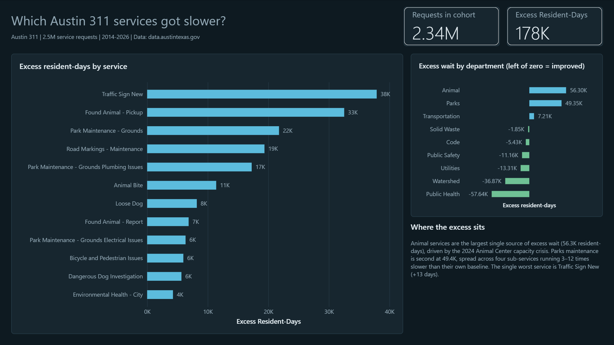
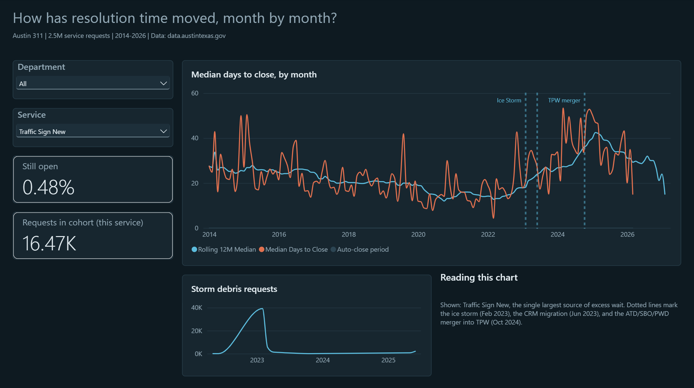
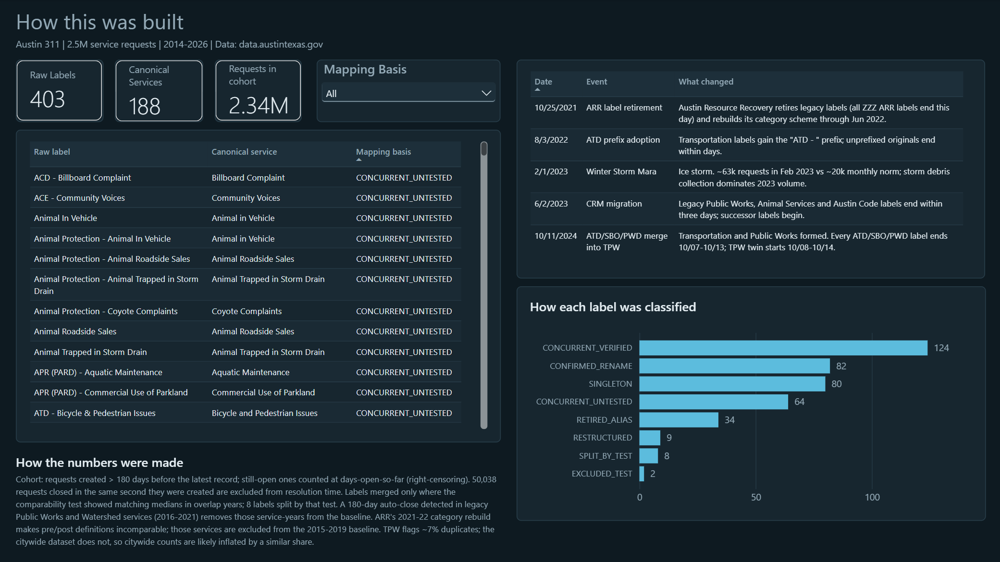

# Austin 311 — Service Degradation Analysis

**Charles Haedge**

Which Austin 311 services have gotten slower, and by how much?

The obvious approach — compare resolution times in 2015 to 2025 — produces garbage,
because the city renamed and reorganized its service categories four times over the
period. A request called `PWD - Pothole Repair` in 2016 is `Pothole Repair` in 2020
and `TPW - Pothole Repair` in 2025, and there is no published crosswalk. Most of the
work here is making the comparison legitimate before making it.

**[View the full report (PDF)](austin311.pdf)** · 2.5M service requests · 2014–2026



---

## Key findings

**178,000 excess resident-days.** One resident-day is one resident waiting one extra
day beyond that service's own 2015–2019 baseline.

- **Animal services** are the largest departmental source at 56.3K resident-days,
  driven by the 2024 Austin Animal Center capacity crisis. Found Animal - Pickup
  alone runs 1,604% above its baseline, with a full recovery visible in 2025.
- **Traffic Sign New** is the worst individual service, running ~13 days slower than
  its baseline.
- **Parks maintenance** is second at 49.4K resident-days, spread across four
  sub-services running 3–12× their historical norm.
- Six departments got *faster* over the same period — Public Health by 57.6K
  resident-days, Watershed by 36.9K.
- The February 2023 ice storm produced ~63,000 requests in a single month against a
  ~20,000 monthly norm, and storm debris collection dominates 2023 volume.



---

## The analytical problem

**403 raw service labels → 188 canonical services.**

Four documented cutover events fragment the taxonomy: the ARR label retirement
(Oct 2021), the ATD prefix adoption (Aug 2022), the CRM migration (Jun 2023), and
the ATD/SBO/PWD merger into Transportation and Public Works (Oct 2024).

Merging labels naively would be worse than not merging them. Two labels can look
like a rename and actually be two parallel queues with different service levels, or
a retroactive relabel where the new name was backfilled onto old records. So every
candidate merge is tested rather than assumed:

> For each pair of labels that might be the same service, compare their median
> resolution times in the years they overlap. Merge only where the medians agree.
> Split where they don't.

Eight labels failed that test and remain separate. Every mapping in the model
carries a `mapping_basis` recording how it was verified — concurrent-verified,
confirmed rename, singleton, retired alias, split-by-test, and so on. The full
mapping table is in `sql/04_type_reconciliation.sql` and is browsable on page 5 of
the report.

---

## The 180-day auto-close

Every legacy Public Works service had a 2015–2019 median of exactly 180–184 days.
Eleven unrelated services do not independently converge on 180.

That is an auto-close timer: the old Public Works system closed requests at 180 days
without an update, and those closes are not resolutions. Any baseline built from
them measures a software rule, not a service.

A detector flags service-years where an unusual share of closures land in a 170–190
day band, or where the annual median itself sits at the timer. The evidence is
unambiguous where it fires:

| Service | Year | Share of closes at 170–190 days |
|---|---|---|
| Pothole Repair | 2018 | 75.5% |
| Debris in Street | 2020 | 88.0% |
| Lost Item in Storm Drain | 2018 | 94.4% |

Flagged service-years are excluded from the baseline. Five services lose their
2015–2019 baseline entirely and are dropped from the ranking — disclosed on the
methodology page rather than quietly omitted.

This also corrected an earlier reading of the data. Tree Issue - Right of Way showed
a ~185-day median in 2016–2017 that looked like a genuine multi-year backlog. It was
the timer.

---

## Validating the method

A constructed baseline is only as good as its agreement with an independent measure.
Austin's Transportation and Public Works dataset carries a city-set due date on every
request, which gives 25 services a second, independent scoring.

| | |
|---|---|
| Services compared | 25 |
| Spearman rank correlation | ρ = 0.42 |
| Mean city late-rate, services flagged **degrading** | 12.8% |
| Mean city late-rate, services flagged **improving** | 5.0% |

The two methods agree on direction — a 2.6× separation between the degrading and
improving groups — and disagree on ordering. Reported as such rather than rounded up.

One disagreement is instructive. Tree Issue - Right of Way has a one-day median but a
31% late rate against its 11-day target: most requests close same-day, a third run
long. A median cannot see a bimodal service; P90 would.



---

## Repository

```
ingest.py                       Socrata/SODA API → SQL Server staging.
                                Paginated, resumable, --since for incremental refresh.
sql/
  01_schema.sql                 Database, staging and warehouse schemas, typed tables
  02_typed_load.sql             TRY_CONVERT from NVARCHAR staging into typed tables
  03_profiling.sql              Ten profiling queries; label lifespans, rename
                                candidates, reverse-engineered TPW targets
  04_type_reconciliation.sql    403-row mapping table + cutover event table
  04b_comparability_test.sql    Median-agreement test for candidate merges
  04c_apply_verdicts.sql        Applies splits, records the basis for every mapping
  05_analysis_views.sql         Cohort fact view, monthly resolution, degradation,
                                TPW target and validation views, date dimension
  05b_autoclose_fix.sql         Auto-close detector; baseline restricted to clean years
  05c_detector_tune.sql         Detector second pass; Spearman validation summary
  05d_materialise.sql           Materialises the detector (2M-row median per reference)
dax_measures.md                 All 23 DAX measures, documented by report page
RUNBOOK.md                      Build order and methodology decisions
austin311.pdf                   Full static report, five pages
images/                         Page screenshots
```

## Reproducing it

Requires SQL Server (Developer Edition is fine), Python 3.10+, and Power BI Desktop.

```bash
pip install requests pyodbc
```

1. Run `sql/01_schema.sql` to create the database and tables.
2. `python ingest.py` — pulls both datasets from data.austintexas.gov into staging.
   Add a Socrata app token to raise the rate limit; it works without one.
3. Run `02` through `05d` in order. `04` is large (403 VALUES rows) and takes a minute.
4. Open the `.pbix` and point the connection at your local instance.

`python ingest.py --since 2026-01-01` refreshes incrementally rather than reloading
2.5M rows.

## Stack

| | |
|---|---|
| **Python** | `requests`, `pyodbc` with `fast_executemany`; SODA API pagination via `$order=:id`/`$offset`, retry with exponential backoff |
| **SQL Server** | Staging-as-NVARCHAR then `TRY_CONVERT`; `PERCENTILE_CONT` window functions for grouped medians; materialised detector table for performance |
| **Power BI** | Star schema over a right-censored cohort view, 23 DAX measures, custom dark theme, conditional formatting driven by measure-returned hex |

## Limitations

Stated here because they're stated in the report.

- **ρ = 0.42 is moderate.** The two methods agree on direction, not on order.
- **The median misses bimodal services.** Tree Issue - Right of Way is the clearest
  case. P90 alongside the median would fix this and is the obvious next iteration.
- **TPW flags ~7% duplicates; the citywide dataset does not.** Citywide counts are
  likely inflated by a similar share.
- **ARR's 2021–22 category rebuild** makes pre/post definitions incomparable for those
  services; they are excluded from the 2015–2019 baseline rather than compared across it.
- **Right-censoring.** The cohort includes only requests created more than 180 days
  before the latest record; still-open requests count at days-open-so-far rather than
  being dropped, since the slowest requests are the ones most likely to still be open.
- **50,038 requests** closed in the same second they were created are excluded from
  resolution-time calculations.

## Data

[City of Austin Open Data Portal](https://data.austintexas.gov/) — Austin 311 Public
Data and the Transportation & Public Works service request dataset. Public domain.
